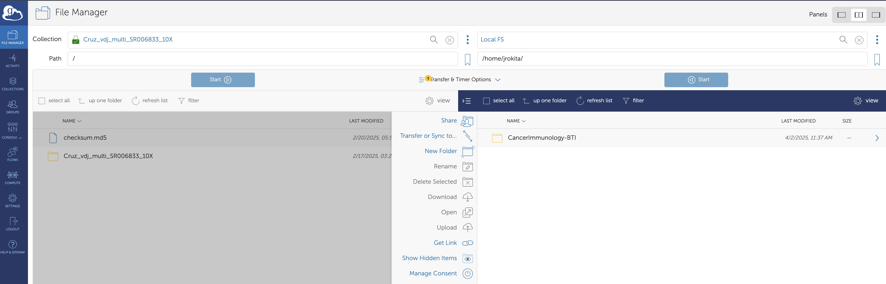

# Access to Resources and Tools

## GitHub

We operate two GitHub organizations, [the Rokita Lab](https://github.com/rokitalab) and [BTI Bioinformatics Core](https://github.com/childrens-bti). All Rokita Lab and BTI Bioinformatics Core staff should be added to both.

## Qumulo (L Drive)

### Requesting access

Please create a new `Access Request` [issue](https://github.com/childrens-bti/internal-ticket-tracker/issues) and obtain approval from Dr. Rokita.
While on Children's National VPN, create an "Incident type" IS request in [Service Now](https://childrensnational.service-now.com/esc?id=ec_pro_dashboard) and request access to `smb://cnmc.org/cri/Lab/CancerImmunology-BTI`.

### Mapping the L Drive

To map the L drive on a macbook:
- While on VPN, Go to the Finder --> Go --> Connect to server and add the path: `smb://cnmc.org/cri/Lab/CancerImmunology-BTI`.

### Instructions for depositing data into `CancerImmunology-BTI`

1. Use this ONLY for raw genomics data which will need to be processed by the BTI Bioinformatics Core and file manifests for those raw data. 
Please, no word docs, ppts, etc.
2. Create one root folder per lab (eg: `FonsecaLab`)
3. Within the lab folder, create project-specific folders.
4. Within project-specific folders, feel free to organize how you'd like (for now 🙂).
5. We can now access the data via HPC and/or upload to AWS very quickly.

## High Performance Cluster (HPC)

### Requesting access

While on VPN, fill out [this](https://criowiki.cnmc.org/doku.php?id=hpc:access) form for HPC access.

### HPC basics 

The HPC Wiki can be found [here](https://criowiki.cnmc.org/doku.php?id=hpc:start).
You can log into the hpc using `ssh hpc.cnmc.org` or alternatively to a specific login node using `ssh pphpcln01.cnmc.org` or ssh `pphpcln02.cnmc.org`.

- To view available modules, use `module avail`.
- To load modules, use module load xxx
- To mount L drive folders (e.g. to mount the L Drive folder `CancerImmunology-BTI`), follow the instructions below, changing the group to the group to which you belong.

```bash
#!/bin/bash

# Add this file under $HOME/.bashrc.d/ with permission '0640'

FOLDER=$HOME/CancerImmunology-BTI
CIFS="//cnmc.org/CRI_LAB1/CancerImmunology-BTI"
GROUP="rokitagrp"

# These settings are generally fine
USER=$(whoami)
FILE_MODE='0750'
DIR_MODE='0750'


case $(hostname) in
    pphpcln*|pphpcdtn* )

    if [ ! -d $FOLDER ]; then
        mkdir -p $FOLDER
    fi

    if ! mountpoint -q $FOLDER
    then

        echo $FOLDER is not mounted
        echo Mounting it...

        sudo /usr/sbin/mount.cifs -o username=${USER},domain=cnmc.org,uid=${USER},gid=${GROUP},dir_mode=${DIR_MODE},file_mode=${FILE_MODE} $CIFS $FOLDER

    fi

esac
```

After sourcing this file, you should be able to see the folder in `/home/USER/CancerImmunology-BTI`.

### Transferring external data onto or from the HPC 

In order to transfer files from Globus to the L drive or vice versa, you must first ssh into the transfer node after completing the above steps:
```
ssh hpc-transfer.cnmc.org
```
This is also the node that you should use for conducting large data transfers from external SFTP servers (for example, from sequencing centers).
If an SFTP server is not accessible from the HPC transfer node, you should fill out a "policy exception" ticket in service now for IT security to whitelist the server and port.

## Amazon Web Services (AWS)

For information about our account, please see pinned file in Slack.

### Requesting access

1. First, obtain email approval from Dr. Jo Lynne Rokita for access to the BTI Bioinformatics AWS account. 
2. Open a Service Catalog item in [Service Now](https://childrensnational.service-now.com/esc?id=ec_pro_dashboard) using the "Add user to existing Access Group for AWS" template.

- AWS account name and number = `<see slack for account number>`
- Request ReadOnly access

### Accessing AWS through the console

Once access is granted, you should be able to access our account using Children's National SSO credentials using [this URL](https://d-9067576cea.awsapps.com/start/). You will have read access to S3 buckets and EC2 Service Catalog launch permissions.

## CAVATICA

If you do not already have an account, you can generate one using your eCommons ID [here](https://cavatica.sbgenomics.com/). 
If you do not have an eCommons ID, please work with Dr. Rokita to get one.

- If you have never received pilot funds when you signed up with CAVATICA, please email `support@velsera.com`, ask for pilot funds, and they will direct your email to Dr. Jared Rozowsky for $100 in credits.
- If you have a project in which you will utilize NIH Kids First datasets or workflows, or wish to enhance Kids First workflows, you may [apply for Kids First Cloud Credits](https://commonfund.nih.gov/kidsfirst/cloudcredits) for CAVATICA, which will get you $1,000 in starter credits.

## Cancer Genomics Cloud (CGC)

CGC is an NIH-hosted CAVATICA instance specifically geared toward cancer researchers and can be accessed through eCommons, as above.
When you first log in, you will be awarded $300 in pilot cloud credits.

- Cancer Genomics Cloud may award up to $10K in cloud credits for bigger project ideas: apply [here](https://www.cancergenomicscloud.org/cgc-apply-for-collaborative-funds).

## Globus

Globus is a file transfer service created by University of Chicago.
Some sequencing centers may utilize Globus to transfer data to us and they will upload a directory of files to Globus for our retrieval.
Additionally, we now have an HPC endpoint called `Local FS` (HPC@CNRIC) for transfer and since we can map the L drive here, we can essentially directly transfer from Globus to L drive.
Each person at Children's National should automatically be able to log into Globus [here](https://www.globus.org/) using `Children's National Health System` SSO.
If you are notified of a project which uses Globus, the user just needs to add your email in order to access the project.
You can log into Globus, open the Collection in `File Manager`, set up the destination to `Local FS` within your folder of choice (see below), then click on `Transfer or Sync to...`.



The transfer window can be closed and you will received an email when the transfer is completed.

## Self-service password reset

On occasion, your password may be reset without warning (!). To reset it, go to [this url](https://cnh.identitynow.com/r/default/reset-password) and follow the instructions.

## Box

We use Box to store various documents for grants, manuscripts, presentations, and collaborator files. 
Open a Service Catalog item in [Service Now](https://childrensnational.service-now.com/esc?id=ec_pro_dashboard) and request access to Box for Children's National.

## Google Drive

We favor Google Drive over OneDrive for collaborative manuscript writing and collaborative documentation. 
Currently, Google Drive is sometimes (or always?) blocked on PCs, but to date, it is available on Apple devices. 

## Paperpile

We have paperpile licenses for individuals actively writing manuscripts on Google Drive needing to insert references. 
There is now a beta version of a Microsoft Word plug-in for paperpile, which can be downloaded [here](https://paperpile.com/word-plugin/).
Instructions for how to use the Word plug-in can be found [here](https://new.paperpile.com/Getting-started-with-Paperpile-and-Word-7ed01d0417a3433f885103ebad04b901).
Please ask Dr. Rokita for a license if you are contributing to grants and/or manuscripts.

- Note: Paperpile "format citations" has a scripting error while on VPN, so you may need to disconnet from Children's National VPN and toggle to GWU VPN for full functionality.

## GWU ID and GWU HPC Access

Fill out the RedCap form [here](https://is.gd/ColonialOne), which will trigger an email to Adam Wong, who will take care of the request.
