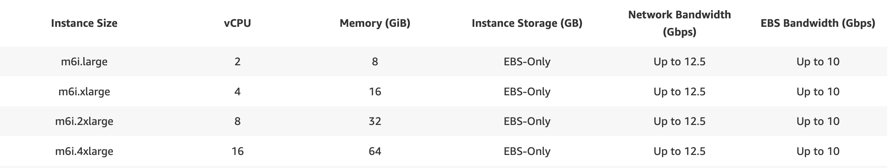
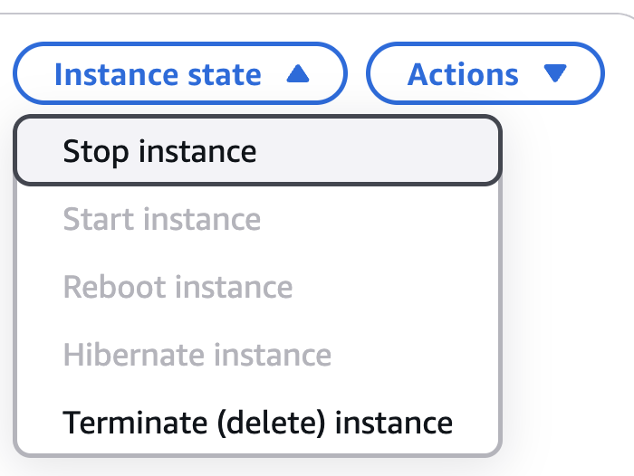

# AWS Computing

## Setting up AWS Single-sign-on (SSO)

Make sure you have [AWS cli](https://docs.aws.amazon.com/cli/v1/userguide/install-macos.html) installed on your local machine.

```bash
aws configure sso
SSO session name (Recommended): <anything>
SSO start URL [None]: <add the start URL, can be found in slack>
SSO region [None]: us-east-1
<Enter>
```

This should open a URL in your browser - accept access

```bash
CLI default client Region [None]: us-east-1
CLI default output format [None]:
CLI profile name [XXX-AccountNumber]: cnh-sso
```

You can now use this new single-sign on profile as

```bash
aws s3 ls --profile cnh-sso
```

## Launching an EC2 Instance from AWS Service Catalog

We have created an EC2 instance template with precompiled utilities and tools, available within the AWS `Service Catalog`.

1. Navigate to the `Service Catalog`.
2. Under `Provisioning`, select `Products`.
3. Select `BTI Research` and Click `Launch Product`.
4. Enter a name for this product so you'll easily remember why you created it (e.g. "Rokita-code-reviews" or "Rokita-dev").
Follow the remaining instructions, filling in your GitHub email and username.
Select an instance type (specs below):
  
5. Select the amount of storage you'd like, keeping in mind that this can be expanded later and we pay for the storage we select.
Typically, you can start at 500 GB or 1 TB.
6. Click `Launch product`.
At this point, the instance will start creation and once complete, you will be able to see the instance ID (`i-###################`).
7. Click the instance ID link and navigate to the top right of the page, where you will see the `Private IPv4 addresses`.
8. While on VPN, copy the IP address, and in your local terminal, type `ssh ubuntu@ip_address`.
You are now connected to your EC2 instance!

To begin working with GitHub on the EC2 instance, you must create an SSH key on the instance and add it to GitHub (see GitHub section).

## Stopping or Terminating an EC2 Instance

To `STOP` an EC2 instance (or shut it down for later), you can either:

- Type `sudo shutdown -h now` into your console while inside of the instance OR
- Navigate to the instance within the AWS Console, click on `Instance state`, and Click `Stop instance`, as below:

	

To `TERMINATE` an EC2 instance (or delete it for good and stop storage charges on it), navigate to the instance within the AWS Console, click on `Instance state`, and Click `Terminate (delete) instance`.

