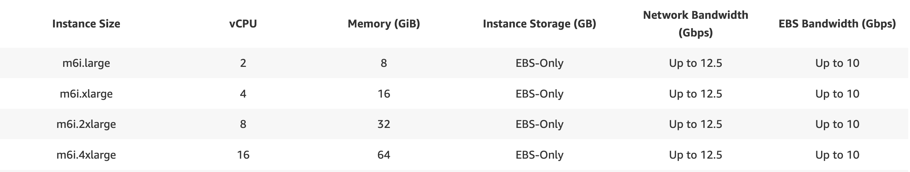
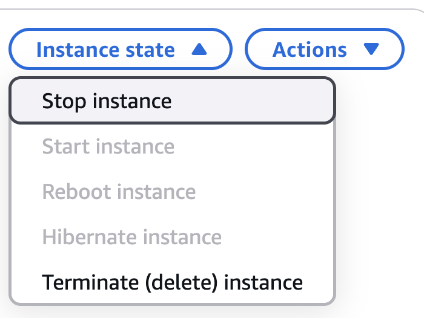

# AWS Computing

## Setting up AWS Single-sign-on (SSO)

Make sure you have [AWS cli](https://docs.aws.amazon.com/cli/latest/userguide/getting-started-install.html) installed on your local machine.

```bash
aws configure sso
SSO session name (Recommended): <anything>
SSO start URL [None]: <add the start URL, can be found in slack>
SSO region [None]: us-east-1
<Enter>
```

This should open a URL in your browser - accept access

```bash
CLI default client Region [None]: us-east-1
CLI default output format [None]:
CLI profile name [XXX-AccountNumber]: cnh-sso
```

You can now use this new single-sign on profile as

```bash
aws s3 ls --profile cnh-sso
```

## Install the AWS Session Manager plugin on macOS

Follow the instructions [here](https://docs.aws.amazon.com/systems-manager/latest/userguide/install-plugin-macos-overview.html) to install the plugin required to connect using AWS Sessions Manager.
Instructions below for Mac with x86_64:

```bash
curl "https://s3.amazonaws.com/session-manager-downloads/plugin/latest/mac/session-manager-plugin.pkg" -o "session-manager-plugin.pkg"
```

```bash
sudo installer -pkg session-manager-plugin.pkg -target /
sudo ln -s /usr/local/sessionmanagerplugin/bin/session-manager-plugin /usr/local/bin/session-manager-plugin
```

## Launching an EC2 Instance from AWS Service Catalog

First, make sure your region is set to `us-east-1`; all work should be performed within this region.
We have created an EC2 instance template with precompiled utilities and tools, available within the AWS `Service Catalog`.

1. Navigate to the `Service Catalog`.
2. Under `Provisioning`, select `Products`.
3. Select `BTI Research` and Click `Launch Product`.
4. Enter a name for this product so you'll easily remember why you created it (e.g. "Rokita-code-reviews" or "Rokita-dev").
Follow the remaining instructions, filling in your GitHub email and username.
Select an instance type (specs below):
  
5. Select the amount of storage you'd like, keeping in mind that this can be expanded later and we pay for the storage we select.
Typically, you can start at 500 GB or 1 TB.
6. Click `Launch product`.
At this point, the instance will start creation and once complete, you will be able to see the instance ID (`i-###################`).
7. Click the instance ID link and navigate to the top right of the page, where you will see the `Private IPv4 addresses`.
8. Using the profile set up above, type the following two commands to get into Sessions Manager, then your EC2:
```bash
aws --profile cnh-sso ssm --region us-east-1 start-session --target i-###################
```
```bash
sudo -iu ubuntu
```
You are now connected to your EC2 instance!

To begin working with GitHub on the EC2 instance, you must create an SSH key on the instance and add it to GitHub (see GitHub section).

## Configure VS Code with AWS Session Manager

You can use VS Code to connect to the EC2 instance through AWS Session Manager using SSH `ProxyCommand` (no separate port forward required).

1. Create an SSH key (if you do not already have one) and add the public key to `~/.ssh/authorized_keys` on the instance.
```bash
ssh-keygen -t ed25519 -C "ec2" -f ~/.ssh/ec2_ed25519
```

2. Open your SSH config in VS Code:
   - Command Palette: `Remote-SSH: Open SSH Configuration File...`
   - Select `~/.ssh/config`

3. Add a host entry to your local SSH config:
```
Host bti-ec2
	HostName i-###################
	User ubuntu
	IdentityFile ~/.ssh/ec2_ed25519
	IdentitiesOnly yes
	ProxyCommand aws --profile cnh-sso --region us-east-1 ssm start-session --target %h --document-name AWS-StartSSHSession --parameters "portNumber=%p"
```

4. In VS Code, open the Command Palette and choose:
`Remote-SSH: Connect to Host...` then select `bti-ec2`.

## Stopping or Terminating an EC2 Instance

To `STOP` an EC2 instance (or shut it down for later), you can either:

- Type 
```bash
sudo shutdown -h now
```
into your console while inside of the instance OR

- Navigate to the instance within the AWS Console, click on `Instance state`, and Click `Stop instance`, as below:

	

To `TERMINATE` an EC2 instance (or delete it for good and stop storage charges on it), navigate to the instance within the AWS Console, click on `Instance state`, and Click `Terminate (delete) instance`.

