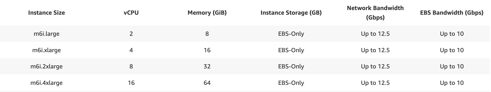
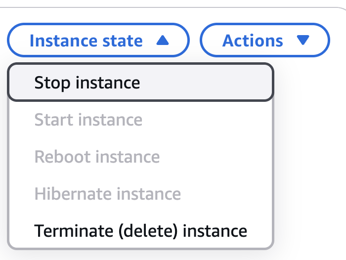

# AWS Computing

## Setting up AWS Single-sign-on (SSO)

Make sure you have [AWS cli](https://docs.aws.amazon.com/cli/latest/userguide/getting-started-install.html) installed on your local machine.

```bash
aws configure sso
SSO session name (Recommended): <anything>
SSO start URL [None]: <add the start URL, can be found in slack>
SSO region [None]: us-east-1
<Enter>
```

This should open a URL in your browser - accept access

```bash
CLI default client Region [None]: us-east-1
CLI default output format [None]:
CLI profile name [XXX-AccountNumber]: cnh-sso
```

You can now use this new single-sign on profile as

```bash
aws s3 ls --profile cnh-sso
```

## Install the AWS Session Manager plugin on macOS

Follow the instructions [here](https://docs.aws.amazon.com/systems-manager/latest/userguide/install-plugin-macos-overview.html) to install the plugin required to connect using AWS Sessions Manager.
Instructions below for Mac with x86_64:

```bash
curl "https://s3.amazonaws.com/session-manager-downloads/plugin/latest/mac/session-manager-plugin.pkg" -o "session-manager-plugin.pkg"
```

```bash
sudo installer -pkg session-manager-plugin.pkg -target /
sudo ln -s /usr/local/sessionmanagerplugin/bin/session-manager-plugin /usr/local/bin/session-manager-plugin
```

## Launching an EC2 Instance from AWS Service Catalog

First, make sure your region is set to `us-east-1`; all work should be performed within this region.
We have created an EC2 instance template with precompiled utilities and tools, available within the AWS `Service Catalog`.

1. Navigate to the `Service Catalog`.
2. Under `Provisioning`, select `Products`.
3. Select `BTI Research` and Click `Launch Product`.
4. Enter a name for this product so you'll easily remember why you created it (e.g. "Rokita-code-reviews" or "Rokita-dev").
Follow the remaining instructions, filling in your GitHub email and username.
Select an instance type (specs below):
  
5. Select the amount of storage you'd like, keeping in mind that this can be expanded later and we pay for the storage we select.
Typically, you can start at 500 GB or 1 TB.
6. Click `Launch product`.
At this point, the instance will start creation and once complete, you will be able to see the instance ID (`i-###################`).
7. Click the instance ID link and navigate to the top right of the page, where you will see the `Private IPv4 addresses`.
8. Using the profile set up above, type the following two commands to get into Sessions Manager, then your EC2:
```bash
aws --profile cnh-sso ssm --region us-east-1 start-session --target i-###################
```
```bash
sudo -iu ubuntu
```
You are now connected to your EC2 instance!

To begin working with GitHub on the EC2 instance, you must create an SSH key on the instance and add it to GitHub (see GitHub section).

## Configuring VS Code with SSH (Deprecated)

The direct SSH setup in the VS Code instructions is retained for historical reference and does not work while connected to the VPN. 
Use VS Code with AWS Session Manager as described above.

You can use VS Code to connect to the EC2 instance through AWS Session Manager using SSH `ProxyCommand` (no separate port forward required).

1\. Create an SSH key (if you do not already have one) and add the public key to `~/.ssh/authorized_keys` on the instance.

```bash
ssh-keygen -t ed25519 -C "ec2" -f ~/.ssh/ec2_ed25519
```

2\. Open your SSH config in VS Code:

- Command Palette: `Remote-SSH: Open SSH Configuration File...`
- Select `~/.ssh/config`

3\. Add a host entry to your local SSH config:

```
Host bti-ec2
    HostName i-###################
    User ubuntu
    IdentityFile ~/.ssh/ec2_ed25519
    IdentitiesOnly yes
    StrictHostKeyChecking accept-new
    UserKnownHostsFile ~/.ssh/known_hosts
    ProxyCommand aws --profile cnh-sso --region us-east-1 ssm start-session --target %h --document-name AWS-StartSSHSession --parameters "portNumber=%p"
```

4\. In VS Code, open the Command Palette and choose `Remote-SSH: Connect to Host...`, then select `bti-ec2`.

## Running Codex CLI on an Ubuntu EC2 Instance

This guide explains how to authenticate and run Codex CLI on a headless Ubuntu
EC2 instance. The instance does not need a browser: the browser on your local
computer completes the Microsoft sign-in through an SSH port-forwarding tunnel.

This guide extends the [CNH Codex CLI setup guide](https://aiml-apim-dev.azure-api.net/developer-docs/code-assistants/codex-cli-setup/).
Follow that guide for the supported-user requirements, Codex installation, the
`cnh-token.py` authentication script, and the Azure/APIM configuration. The
steps below address the EC2-specific authentication flow.

### Prerequisites

- Codex CLI version 0.146.0 is installed on the EC2 instance. (version 0.147 does not work with our Azure models.)
- Python 3.12 or later is available on the instance.
- The `cnh-token.py` script has been downloaded from the CNH setup guide.
- You can connect to the instance over SSH from your local computer.
- You are in an approved user group for the CNH coding-assistant endpoint.

### 1. Create a Python virtual environment

Ubuntu may prevent packages from being installed into its system Python
environment because of [PEP 668](https://peps.python.org/pep-0668/). Install the
authentication dependencies in an isolated virtual environment instead.

On the EC2 instance:

```bash
# Install Python 3.12 and venv support if needed.
sudo apt-get update
sudo apt-get install -y python3.12 python3.12-venv

# Create the virtual environment inside ~/.codex.
python3.12 -m venv ~/.codex/venv

# Install the authentication dependencies into the virtual environment.
~/.codex/venv/bin/python -m pip install --upgrade pip
~/.codex/venv/bin/python -m pip install msal msal-extensions

# Verify the dependencies.
~/.codex/venv/bin/python -c "import msal, msal_extensions; print('ok')"
```

Save `cnh-token.py` to `~/.codex/cnh-token.py`, or use another location and
update the path in `~/.codex/config.toml`. The authentication command must use
the virtual environment's Python:

```toml
[model_providers.azure.auth]
command = "/home/<user>/.codex/venv/bin/python"
args = ["/home/<user>/.codex/cnh-token.py"]
timeout_ms = 120000
```

Replace `<user>` with the EC2 instance user, such as `ubuntu` or `ec2-user`.

### 2. Start authentication on the EC2 instance

Open a terminal connected to the EC2 instance and run:

```bash
~/.codex/venv/bin/python ~/.codex/cnh-token.py
```

On a headless instance, the script reports that no browser was found, publishes
a randomly assigned callback port, prints an `Auth URI`, and waits for the
sign-in callback. Leave this command running.

The easiest way to find the port is the script's published-port message. The
output will look similar to this, where `<PORT>` is different for each
authentication attempt:

```text
Found no browser in current environment. ... published port <PORT> to host network ...
Auth URI: https://login.microsoftonline.com/...&redirect_uri=http%3A%2F%2Flocalhost%3A<PORT>&...
```

Use the number shown after `published port` as the value of `PORT` in the SSH
command below. The `redirect_uri` in the current `Auth URI` should contain the
same number and provides a confirmation:

```text
redirect_uri=http%3A%2F%2Flocalhost%3A<PORT>
```

Use the complete `Auth URI` from the current run. Do not reuse a port, `state`,
or `code_challenge` from an earlier attempt.

### 3. Forward the current callback port over SSH

Open a second terminal on your local computer. Fill in the port number shown in the current authentication attempt's published-port message. Then ssh forwards that same port to the EC2 instance. `<user>@<ec2-host>` is your host name for the ssh profile that you set up for your EC2 instance e.g. `ubuntu@bti-ec2`

```bash
ssh -N -o ExitOnForwardFailure=yes \
  -L "${PORT}:127.0.0.1:${PORT}" \
  <user>@<ec2-host>
```

Do not replace `PORT` with a port from a previous run. The `-L` option maps the local port to the same callback port on the EC2 instance, and `-N` keeps this terminal dedicated to forwarding. Leave the SSH command running.

If you use an SSH host alias, substitute that alias for `<user>@<ec2-host>`.

### 4. Sign in from your local browser

1. Copy the entire `Auth URI` printed in the EC2 terminal.
2. Paste it into a browser on your local computer and sign in with your
   Microsoft credentials.
3. The browser redirects to `http://localhost:<PORT>/?code=...`. The SSH tunnel
   sends that callback to the authentication script on the EC2 instance.
4. Wait for the script to exchange the code, cache the token on the instance,
   and exit successfully.

If the browser cannot connect to `localhost:<PORT>`, verify that the SSH
tunnel is still running and that its port came from the current `Auth URI`. If
you restart `cnh-token.py`, it may select a new port; use the new URI and
create the tunnel again with that new port.

After the authentication script exits, the tunnel terminal can be closed.

### 5. Run Codex CLI

Back on the EC2 instance, change to the project directory and start Codex:

```bash
cd /path/to/your/project
codex
```

The first time Codex runs in a directory, it asks whether you trust the
directory contents. Select **1. Yes, continue** for a directory you own.

Consider running Codex inside `tmux` or `screen` so it continues running after
an SSH disconnect:

```bash
tmux new -s codex
cd /path/to/your/project
codex
```

### Future authentication

`msal-extensions` caches the token on the EC2 instance. Future Codex launches
can reuse or refresh it without opening a browser or creating an SSH tunnel.
Repeat the authentication steps if the refresh token expires or is revoked, or
if the token cache is removed when the instance is rebuilt.

Persist `~/.codex` on storage that survives instance replacement if you want to
retain the configuration and token cache. Treat the cache as sensitive and do
not commit it to a repository.

### Known endpoint compatibility issue

On the CNH APIM endpoint, newer Codex CLI version 0.147 may fail with `gpt-5.6-*`
models and report an error like:

```text
Invalid 'input[0].tools[0].description': empty string ...
```

However this appears to be fixed in version 0.148. If this occurs on every prompt, upgrade your codex to the latest version:

```bash
sudo npm install -g @openai/codex
codex --version
```

Restart Codex after changing the CLI version. If rolling back is not possible,
use `gpt-5.5-aiml` in the top-level `model` setting and in any profile that you
use in `~/.codex/config.toml`:

```toml
model = "gpt-5.5-aiml"
```

### Troubleshooting

| Symptom | Cause | Fix |
|---|---|---|
| `error: externally-managed-environment` | Packages are being installed into system Python. | Use the virtual environment; do not use `--break-system-packages`. |
| The script says no browser was found and waits | The EC2 instance is headless and is waiting for the callback. | Leave it running, read the published port, start the SSH tunnel, and complete sign-in. |
| The browser cannot reach `localhost:<PORT>` | The tunnel is not running or uses a stale/wrong port. | Use the port from the current published-port message, verify it against the `Auth URI`, and start the tunnel again. |
| Codex appears frozen on launch | The authentication command is waiting for the browser callback. | Complete the sign-in flow or inspect the authentication terminal for errors. |
| `tools[0].description: empty string` appears on every prompt | The CLI and `gpt-5.6-*` model are incompatible with this endpoint. | Install `@openai/codex@0.146` or use `gpt-5.5-aiml`. |
| Codex cannot find `msal` at authentication time | The auth command points to a different Python installation. | Set `command` to the full path `~/.codex/venv/bin/python`. |

Verify the authentication interpreter at any time:

```bash
~/.codex/venv/bin/python -c "import msal, msal_extensions; print('ok')"
```

## Stopping or Terminating an EC2 Instance

To `STOP` an EC2 instance (or shut it down for later), you can either:

- Type 
```bash
sudo shutdown -h now
```
into your console while inside of the instance OR

- Navigate to the instance within the AWS Console, click on `Instance state`, and Click `Stop instance`, as below:

	

To `TERMINATE` an EC2 instance (or delete it for good and stop storage charges on it), navigate to the instance within the AWS Console, click on `Instance state`, and Click `Terminate (delete) instance`.
