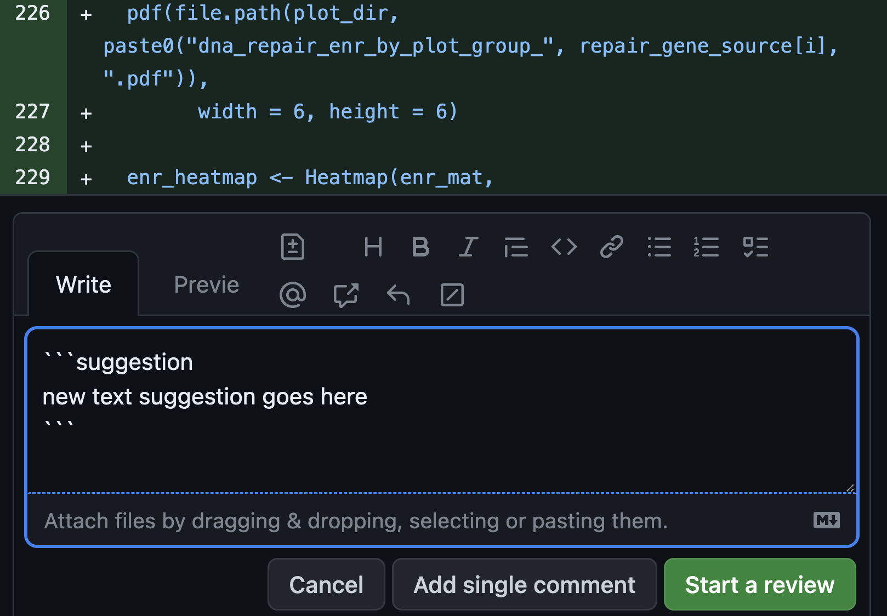

# Code Review Guidelines

All pull requests will undergo peer review, and we do so while maintaining a culture of positive peer review.

## Our Code Review model, based on [OpenPedCan](https://github.com/rokitalab/OpenPedCan-Project-CNH/blob/dev/CONTRIBUTING.md#pull-requests).

The review intends to ensure that a pull request conforms to the following basic requirements:

- The code is correct.
- The results can be reproduced in a reasonable amount of time.
- The results are expected.
- The documentation describes the purpose, methods, results, input, output, and how to run the code.
- The code follows basic style guidelines.
- The code contains comments that explain non-obvious procedures.
- The analysis is scientifically sound.

But, why?

- To foster a culture of collaboration.
- To [allow junior team members to learn from senior team members](https://smartbear.com/blog/developing-a-culture-of-mentorship-with-code-revie/), or frequently, vice versa!
- To spark knowledge transfer, not only of coding practices, but also through project-specific analyses and subject matter.
- To track our changes and thoughts over time (i.e. this is our virtual lab notebook).
- To maintain our high standard of reproducibility and rigor.
- To have all code, figures, and tables ready for future manuscript submission.

## Rules of thumb:

1. Always rerun the module to ensure it works and outputs can be reproduced identically.
2. Review ≤ 400 lines of code (LOC) at a time
3. Do not review for more than 60 minutes at a time.
4. Take 20 minute breaks in between reviews.

Pull requests can be reviewed using [GitHub's review interface](https://help.github.com/articles/about-pull-request-reviews/). Following are the basic guidelines for reviewing pull requests:

- Note the type of review you performed: did you look over the source code, did you look over the documentation, did you run the source code, did you look at and interpret the results or a combination of these?
- Suggest modifications or, potentially, directly suggest, ***but do not commit changes to***, the pull request.
- Explain in **detail** whether and why the suggested modifications are **necessary**, and how the modifications should be implemented specifically, so that the developers are able to follow the suggestions without misunderstanding.
- For any suggestions/comments that are related to the lines that were changed in the particular PR, make the comment underneath the code by clicking the "+" next to the code (see below images). Click "Start a review" for the first comment, and afterwards, click "Add single comment" to keep all comments within the same review. Click "Finish your review" once completed.

- If there are any comments/suggestions that are **outside** of the code changes this particular PR, for example, any questions about the results, or any lines of code (although not changed) that seemed puzzling, mention them as comments after you click "Finish your review". The permalinks of the referenced results or code can be obtained by the following procedure: click the "Commits" tab of the pull request, browse the repository at a specific commit that contains the referenced results or code by clicking the `<>` button of the commit row, go to the referenced file in the repository to get file or line permalinks.
- If the suggested modifications are extensive refactoring or re-designing without any change on the code behaviors, results or run-time, consider submitting a new issue for the refactoring or re-designing, and discussing the priority and specific implementations in the new issue, after the pull request under review is merged, so that the pull request under review will not be kept open for lengthy discussions and commits on extensive refactoring or re-designing that are out of the scope of the original pull request addressed issue.

Before a repository maintainer merges a pull request, there must be at least one affirmative review. If there is any unaddressed criticism or disapproval, a repository maintainer will determine how to proceed and may wait for additional feedback.

## Merging approved pull requests

If working on a collaborative repository, and a pull request is approved, please do **not** merge it immediately. Instead, wait for the repository maintainer to coordinate with you on when to merge the pull request and whether the pull request should be updated with the latest `dev` or `main` branch. The coordination can reduce the workload of developers for checking whether the `dev` or `main` branch updates by merging other pull requests will affect their own pull requests.

## Additional Code Review Resources

[Fred Hutch Data Science Lab](https://hutchdatascience.org/code_review/index.html#resources-for-lab-developers)

[SmartBear Code Review](https://smartbear.com/learn/code-review/best-practices-for-peer-code-review/)