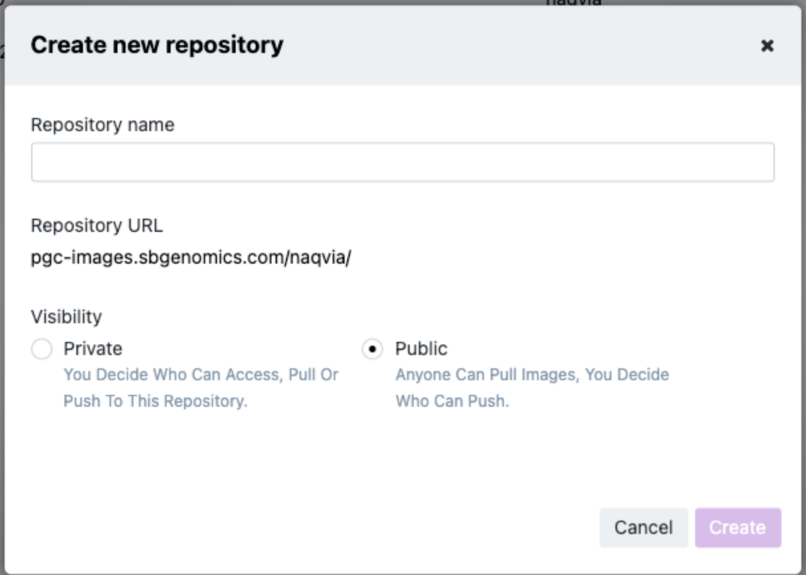

# Using Docker or Podman for Containerizing Code

We will containerize all packages which can be redistributed without licenses using Docker containers. You can work with these using either [Docker](https://www.docker.com/) or [Podman](https://podman.io/).

## Creating a Dockerfile and Docker Image 

**How to create a docker registry in CAVATICA**

Create a repository

- Log into [CAVATICA](https://cavatica.sbgenomics.com/)
- Click on `Developer` tab -> `Docker registry`
- Click `+ Create repository` (top right)
- Type repository name and choose visibility and click `create`.



- Assign admin rights to Jo Lynne Rokita (`harenzaj`) and Alex Sickler (`sicklera`) by clicking on: `<Name of Repository>/ Members`

**Docker Login**

Login into CAVATICA docker registry using CAVATICA credentials

```bash
docker login [pgc-images.sbgenomics.com](http://pgc-images.sbgenomics.com/) -u <USERNAME> -p <YOUR-AUTH-TOKEN>
```

**Build Image**

```bash
docker build -t pgc-images.sbgenomics.com/<username>/<repository_name>[:tag] .
```

*Example*: 
```bash
docker build -t pgc-images.sbgenomics.com/naqvia/autopvs1:latest .
```

For Mac users (M1 chip), you may need to specify the platform

```bash
docker build --platform=linux/amd64 -t pgc-images.sbgenomics.com/<username>/<repository_name>[:tag] .
```

*Example*: 

```bash
docker build --platform=linux/amd64 -t  pgc-images.sbgenomics.com/naqvia/autopvs1:latest .
```

## Pushing the Docker Image

```bash
docker push pgc-images.sbgenomics.com/<username>/<repository_name>[:tag]
```

where `<username>/<repository_name>[:tag]` refers to the image that you have already committed

*Example*: `docker push pgc-images.sbgenomics.com/naqvia/autopvs1:latest`

## Pulling the Docker Image

```bash
docker pull pgc-images.sbgenomics.com/<username>/<repository_name>[:tag]:<tagname>
```

*Example*: 
```
docker pull pgc-images.sbgenomics.com/naqvia/autopvs1:latest
```

## Updating the Docker Image

Make any necessary changes to `Dockerfile` and run `docker build` as done previously. 

Once complete, the output will print `Successfully built <image ID>`. Tag this image ID to the remote repo and push using these steps: 

```bash
docker tag <image ID> pgc-images.sbgenomics.com/<username>/<repository_name>:[tag]
docker push pgc-images.sbgenomics.com/<username>/<repository_name>:[tag]
```

For more, please review the [full documentation](https://docs.sevenbridges.com/docs/manage-docker-repositories-advance-access).

For more about Docker using M1/M2/M3 chip macs, ([see here](https://tutorials.tinkink.net/en/mac/how-to-use-docker-on-m1-mac.html)).
