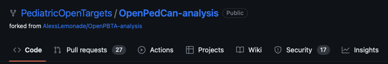
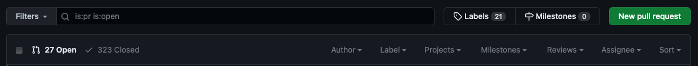
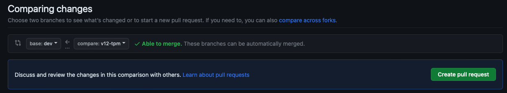
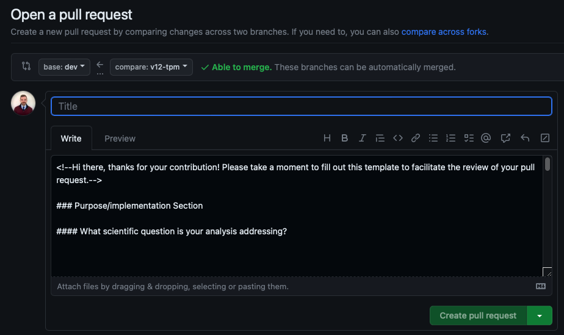
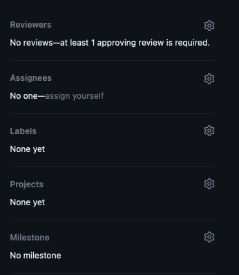

# GitHub Code and Pull Request (PR) Guidelines

We prefer the use of `tidyverse` functions over base R, when possible. The reason for this is so that all developers and reviewers are speaking the same language, making coding and reviewing easier across the team. 

- Additional style guidelines
    - We follow the [tidyverse style guide](https://style.tidyverse.org/index.html) for writing code.
    - Avoid `CamelCase` unless already in a package function being used.

## Preparing Code for a Pull Request (PR) and Review - Some Principles

1. **Create quantifiable and transparent analysis goals**

    - Usually PRs will be linked to an issue (bug fix, new module development, module rerun with new data) or a scientific question we are seeking to answer. Clearly define this ahead of time by submitting an issue to track what you’d like to do/have done or keep this in mind when creating a new branch for a future review.

2. **Use informative commit messages**

    - *“Update 01-new-analysis-01.R”* does not adequately explain what was done in that commit. It will be harder for you to go back and find where you changed something and harder for the reviewer to understand what was changed in that commit. Something like *“fix bug in survival cox ph function”* is more informative. Additional (bulleted) information can be added to the within the commit message if more detail is needed. 
    - See [“Why good commit messages matter”](https://cbea.ms/git-commit/).

3. **Keep PRs  ≤ 400 lines of code (LOC)**

    - In practice, a review of 200-400 LOC over 60 to 90 minutes should yield 70-90% defect discovery. Therefore, we aim to have PRs within this 200-400 LOC limit.

4. **Separate your scripts by purpose, and stack the PRs.**

    - Frequently, an analysis module has multiple scripts. Sometimes a module contains a new function. In these cases, you should separate your PRs by script, stacking them in the order in which they should be reviewed. For more on stacking PRs, see below.
    - See our repository structure guidelines.

5. **Annotate your code.**
    1. This should be done throughout the code, explaining each code chunk in a notebook and/or steps for an analysis. Reviewers will find fewer bugs/mistakes when authors read through and annotate their own code before submitting it for review.

6. **Add a module README.**

    - See [OpenPedCan's Documenting Your Analysis](https://github.com/rokitalab/OpenPedCan-Project-CNH#documenting-your-analysis).

7. **Add a module run script.**

    - Usually this is a shell script which runs all of the module scripts in order.

8. **Clearly document your goals within the PR template.**

    - Remember, a reviewer may not have the background of your project or previous analyses leading up to the PR in question, so it is very helpful to the reviewer when the PR is clearly described.

## Check out a new branch

1. **To make local changes to project repo, checkout a new branch:** 
    
        git switch -c <new-branch>
    
2. **Make desired changes to project repo in new branch (usually one script per PR)**
    - Add new analysis module
    - Edit an existing module (add/edit scripts, etc.)
    - Add new packages to project `Dockerfile`
    - Add data files for new data release

3. **Change branch index to reflect any local changes**
    
    - `git add <FILE>` for any new or edited files or `git add -A` to add *all* changed files
    
    - `git rm <FILE>` for any deleted files
    
4. **Commit local changes to branch, and includes a message describing what changes were made**
    
        git commit -m "message-regarding-changes"
    
5. **Push commit(s) to remote repository**
    
        git push origin <new-branch>
    
    This will push commits to remote branch `new-branch`, which will be created if it does not already exist. 
    
    If authentication is required, the user needs to do the following:
    
    - Go to github page → personal account/Settings/Developer settings
    choose tokens (classic) → Generate new token
    - Once in the terminal and asked for authentication, use the token as password.
    

## Update local git repo

- To download all changes from remote repo to local repo, use:
    
        git fetch
    
- To download changes AND merge them into current branch, use:
    
        git pull
    
## Submitting a Pull Request (PR)

Any changes pushed to a project repo branch must be reviewed by team members prior to merging into another branch. This is accomplished by submitting a pull request (PR) that compares the new branch to the one you would like to merge into, and describes changes made. 

1. **Navigate to remote project repo, and click “Pull Requests”:** 
    
    
    

1. **Click “New pull request”**
    
    
    
2. **Select two branches to compare.** The `base` branch should be the branch in which changes were made, and the `compare` branch should be the one into which you would like to merge. For example if you wanted to merge branch `v12-tpm` into `dev`:
    
    
    
3. **Click “Create pull request”.** This will navigate you to a page where you can provide a brief title and a description that reflects changes. At minimum, you should give details on: 1) changes made to repository and their motivation, 2) what kind of feedback you are seeking from reviewers, and 3) anything else that should be discussed regarding analyses and other changes. If a markdown template is in place (see example below), all questions should be answered prior to submitting PR. 
    
    
    
4. **Once completed, click “Create pull request”.** The PR should now be visible if you navigate to open PRs. 
5. **Add reviewers and labels to PR.**
    
    There is a sidebar on the “Open a pull request” page and PR page that allows you to choose reviewers and add labels to PR.
    
    
    
    To add reviewers, click “Reviewers” and type in GitHub username of desired reviewer
    
    To add labels, click “Labels” and add desired label (e.g., “Ready for Review”, “Blocked”, “Stacked”). 

## Stacking PRs

- To stack a PR, checkout the branch on which you would like to stack your next PR:
    
        git switch branch-1
    
- Then, from within *that* branch, and not main/master/dev, create a new branch for the stacked PR:
    
        git switch branch-2 
    
- Once you create your PR with the second branch, then change the base branch to `branch-1`. Now, you should see *only* the changes in `branch-2` in your PR.
- These PRs either have to be merged *in stacked order* or they need to be merged backwards.
    - If merging in order, then be sure to delete the branch post merge of each PR. This will automatically trigger changing of the base branch to `main` or `master` or `dev` in preparation for the next PR merge.
    - If merging backwards, such as with data releases, they should all be approved first, and keep note that the number of changed files will get larger, making it harder to track.

