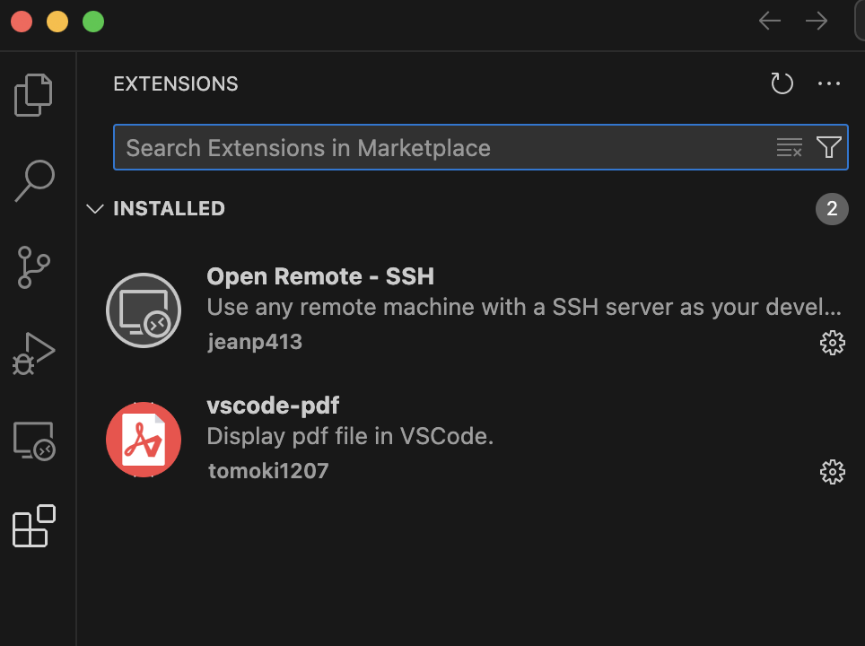
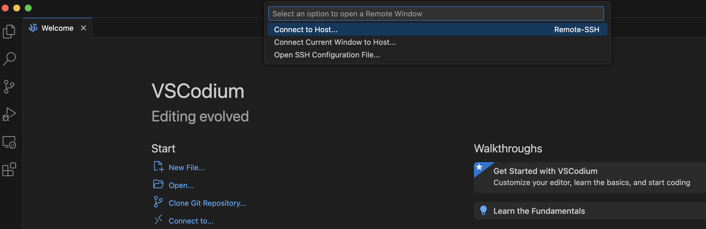
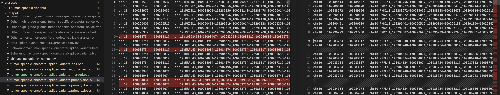

# Using VSCodium for Code Reviews 

There are multiple free text editors available which can be useful for code review, but I highlight the open-source editor, [VSCodium](https://vscodium.com/) here because of ease of use.

## Connecting VSCodium to your EC2 Instance

In order to connect VSCodium to your EC2 instance, you will need to configure your local SSH profile.
To do so, you need to update your config file located at `~/.ssh/config` to include the private SSH key on your instance.

1. From your instance, `cat ~/.ssh/id_ed25519` and copy this into a new text file on your computer, for instance `~/.ssh/ec2_key`.
2. Create a `config` file in `~/.ssh/config` if none exists, or simply add to it the information below:

    ```bash
Host name_here
    HostName ip_address
    User ubuntu
    IdentityFile ~/.ssh/ec2_key
    ```

3. Click on the tetris box-looking icon, search `Open Remote - SSH`, and install the plug-in.
    
4. Within VSCodium, Click `Connect to`, then `Connect to Host` and Type in `ubuntu@ip_address`.
    

You should be in!

## Code Review with VSCodium

You can navigate to the repository of interest within VSCodium and any differences in your branch compared to the remote branch will now show up with different color codes as below.
This is very handy when trying to get an overall view of differences in images and/or files with multiple differences.
Below, on the left, multiple files have changes (M = modified) and on the right, there are differences between the local and remote file (red, deleted lines).

